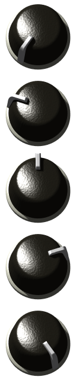
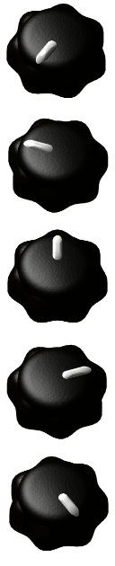
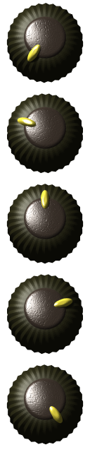
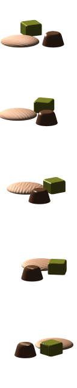

KnobMan3D
=========

Knob Image Design Tool

KnobMan3D is a Knob Image (film-strip) design tool based on WebGL + THREE.js

* Create your own knobs by combination of basic objects
* Animation effects available
* Rendered image can be exported as PNG file

[Sample-simple](http://g200kg.github.io/knobman3d/?d=eyJjYW15IjoiLTE2IiwiY2Ftem9vbSI6MTcwLCJ3aWR0aCI6NjQsImhlaWdodCI6NjQsImZyYW1lcyI6MTcsImxheWVyIjpbeyJuYW1lIjoiT2JqMSIsInByaW0iOnsidHlwZSI6ImN5bGluZGVyIiwic21vb3RoIjozNiwiaGVpZ2h0IjoxMCwidGV4dHVyZSI6IkF1cmEiLCJjb2xvciI6MTMyMjQxMTl9LCJlZmYiOnt9fSx7Im5hbWUiOiJPYmoyIiwicHJpbSI6eyJ0eXBlIjoiY3lsaW5kZXIiLCJkZWZsYXRlIjoxOSwic21vb3RoIjoyMCwiaGVpZ2h0Ijo2MiwidGV4dHVyZSI6IlNhbmQiLCJ0ZXhkZXB0aCI6LTQsImNvbG9yIjoyMjM2NDQyfSwiZWZmIjp7Inpvb214MSI6OTQsImFuZ2xlMSI6LTE0NSwiYW5nbGUyIjoxNDUsImFuZ2xlYSI6IjAifX0seyJuYW1lIjoiT2JqMyIsInByaW0iOnsidHlwZSI6ImN1YmUiLCJhc3BlY3QiOjc0LCJkZWZsYXRlIjoxOCwic21vb3RoIjozOSwiaGVpZ2h0Ijo2OCwidGV4dHVyZSI6IkF1cmEiLCJjb2xvciI6MTU3OTA1NzZ9LCJlZmYiOnsiem9vbXgxIjozNywib2Zmc2V0eTEiOjMxLCJhbmdsZTEiOi0xNDUsImFuZ2xlMiI6MTQ1LCJhbmdsZWEiOiIwIn19XX0=)  
[Sample-waveknob](http://g200kg.github.io/knobman3d/?d=eyJjYW15IjoiLTMxIiwiY2Ftem9vbSI6MTQzLCJ3aWR0aCI6NjQsImhlaWdodCI6NjQsImZyYW1lcyI6MTcsImxheWVyIjpbeyJuYW1lIjoiT2JqMSIsInByaW0iOnsidHlwZSI6ImN5bGluZGVyIiwid2F2ZSI6Nywid2F2ZWFuZ2xlIjo3LCJzbW9vdGgiOjQ2LCJoZWlnaHQiOjM4LCJzaGluaW5lc3MiOjIyLCJ0ZXh0dXJlIjoiQXVyYSIsImNvbG9yIjoyNjMxNjl9LCJlZmYiOnsiem9vbXgxIjoxMTYsImFuZ2xlMSI6LTE0NSwiYW5nbGUyIjoxNDUsImFuZ2xlYSI6IjAifX0seyJuYW1lIjoiT2JqMiIsInByaW0iOnsidHlwZSI6ImN5bGluZGVyIiwic21vb3RoIjozNiwiaGVpZ2h0Ijo0NSwic2hpbmluZXNzIjoxMCwidGV4dHVyZSI6IlNhbmQiLCJ0ZXhkZXB0aCI6MywiY29sb3IiOjY1NzkyfSwiZWZmIjp7ImFuZ2xlMSI6LTE0NSwiYW5nbGUyIjoxNDUsImFuZ2xlYSI6IjAifX0seyJuYW1lIjoiT2JqMyIsInByaW0iOnsidHlwZSI6ImN1YmUiLCJhc3BlY3QiOjczLCJyb3VuZCI6MzUsInNtb290aCI6ODksImhlaWdodCI6NDgsInNoaW5pbmVzcyI6MTYxLCJ0ZXh0dXJlIjoiQXVyYSIsImNvbG9yIjoxNjcxMTQxNX0sImVmZiI6eyJ6b29teDEiOjY0LCJvZmZzZXR5MSI6MjMsImFuZ2xlMSI6LTE0NSwiYW5nbGUyIjoxNDUsImFuZ2xlYSI6IjAifX1dfQ==)  
[Sample-knurling](http://g200kg.github.io/knobman3d/?d=eyJjYW15IjoiLTEwIiwiY2Ftem9vbSI6MTY2LCJ3aWR0aCI6NjQsImhlaWdodCI6NjQsImZyYW1lcyI6MTcsImxheWVyIjpbeyJuYW1lIjoiT2JqMSIsInByaW0iOnsidHlwZSI6ImN5bGluZGVyIiwid2F2ZSI6Miwid2F2ZWFuZ2xlIjozMiwic21vb3RoIjo0OCwiaGVpZ2h0Ijo1OSwic2hpbmluZXNzIjo4LCJ0ZXh0dXJlIjoiQXVyYSIsImNvbG9yIjoyNTY1OTEwfSwiZWZmIjp7ImFuZ2xlMSI6LTE0NSwiYW5nbGUyIjoxNDUsImFuZ2xlYSI6IjAifX0seyJuYW1lIjoiT2JqMiIsInByaW0iOnsidHlwZSI6ImN5bGluZGVyIiwiYXNwZWN0Ijo1NSwic21vb3RoIjo4MCwiaGVpZ2h0Ijo2NCwidGV4dHVyZSI6IkF1cmEiLCJjb2xvciI6MTYzMTIxMzV9LCJlZmYiOnsiem9vbXgxIjo0Miwib2Zmc2V0eTEiOjI0LCJhbmdsZTEiOi0xNDUsImFuZ2xlMiI6MTQ1LCJhbmdsZWEiOiIwIn19LHsibmFtZSI6Ik9iajMiLCJwcmltIjp7InR5cGUiOiJjeWxpbmRlciIsInNtb290aCI6MjgsImhlaWdodCI6NjEsInRleHR1cmUiOiJBdXJhIiwidGV4ZGVwdGgiOi03LCJ0ZXh6b29tIjo0NywiY29sb3IiOjQwNzY1ODl9LCJlZmYiOnsiem9vbXgxIjo2NCwiYW5nbGUxIjotMTQ1LCJhbmdsZTIiOjE0NSwiYW5nbGVhIjoiMCJ9fV19)  
[Sample-led](http://localhost/github/knobman3d/?d=eyJjYW15IjowLCJhbWJpZW50IjoiMTkiLCJjYW16b29tIjoxODMsImV4cG9ydHR5cGUiOiJ2ZXJ0Iiwid2lkdGgiOjY0LCJoZWlnaHQiOjY0LCJmcmFtZXMiOjUsImxheWVyIjpbeyJuYW1lIjoiT2JqMSIsInByaW0iOnsidHlwZSI6ImN1YmUiLCJyb3VuZCI6MTAsInNtb290aCI6MjcsImhlaWdodCI6MTAsInNoaW5pbmVzcyI6OSwidGV4dHVyZSI6IkNvYWwiLCJ0ZXhkZXB0aCI6LTEzLCJjb2xvciI6NDM5OTY0OX0sImVmZiI6e319LHsibmFtZSI6Ik9iajIiLCJwcmltIjp7InR5cGUiOiJjeWxpbmRlciIsImRlZmxhdGUiOjYsImhlaWdodCI6MTUsInNoaW5pbmVzcyI6NDIsInRleHR1cmUiOiJBdXJhIiwiY29sb3IiOjU2NTc5NDB9LCJlZmYiOnsiem9vbXgxIjo5MX19LHsibmFtZSI6Ik9iajMiLCJwcmltIjp7InR5cGUiOiJjeWxpbmRlciIsInNtb290aCI6MTAwLCJoZWlnaHQiOjMwLCJzaGluaW5lc3MiOjksInRleHR1cmUiOiJBdXJhIiwiY29sb3IiOjE2NjUxNzk4fSwiZWZmIjp7Inpvb214MSI6OTAsImJyaWdodDEiOi02MSwiYnJpZ2h0MiI6MTAsImJyaWdodGEiOiIwIn19XX0=)  
[Sample-objects](http://g200kg.github.io/knobman3d/?d=eyJjYW15IjoiLTczIiwid2lkdGgiOjY0LCJoZWlnaHQiOjY0LCJmcmFtZXMiOjE3LCJsYXllciI6W3sibmFtZSI6Ik9iajEiLCJwcmltIjp7InR5cGUiOiJjeWxpbmRlciIsInNtb290aCI6MTAwLCJoZWlnaHQiOjEwLCJzaGluaW5lc3MiOjQsInRleHR1cmUiOiJQbGFudCIsInRleGRlcHRoIjotMTgsInRleHpvb20iOjI2LCJjb2xvciI6MTU5MDY5NjF9LCJlZmYiOnsib2Zmc2V0eDEiOi0zOCwib2Zmc2V0eTEiOjQwLCJhbmdsZTEiOi03NiwiYW5nbGUyIjo5MSwiYW5nbGVhIjoiMCJ9fSx7Im5hbWUiOiJPYmoyIiwicHJpbSI6eyJ0eXBlIjoiY3lsaW5kZXIiLCJkZWZsYXRlIjozMCwic21vb3RoIjozMiwiaGVpZ2h0IjozMSwidGV4dHVyZSI6IkF1cmEiLCJjb2xvciI6ODA4MTQ2M30sImVmZiI6eyJ6b29teDEiOjU3LCJvZmZzZXR4MSI6LTM0LCJvZmZzZXR5MSI6LTUxLCJhbmdsZTEiOi03MiwiYW5nbGVhIjoiMCJ9fSx7Im5hbWUiOiJPYmozIiwicHJpbSI6eyJ0eXBlIjoiY3ViZSIsInJvdW5kIjoyNiwic21vb3RoIjoyMCwiaGVpZ2h0IjozMCwidGV4dHVyZSI6IlNhbmQiLCJ0ZXhkZXB0aCI6MTEsInRleHpvb20iOjIwMCwiY29sb3IiOjk4NzAxMjl9LCJlZmYiOnsiem9vbXgxIjo0NSwib2Zmc2V0eTEiOjQ5LCJhbmdsZTEiOi0yMywiYW5nbGUyIjoxMzcsImFuZ2xlYSI6IjAifX1dfQ==)  

    

Available at :
  [http://g200kg.github.io/knobman3d/](http://g200kg.github.io/knobman3d/)

## License
 Copyright (c) 2016 g200kg http://www.g200kg.com/  

KnobMan3D : licensed under MIT License.   
Sample knobs : licensed under Creative Commons Zero CC0

#### Used Libraries:
THREE.js : MIT License  
https://github.com/mrdoob/three.js/blob/master/LICENSE  

jsgif (GIFEncoder.js/NeuQuant.js/LZWEncoder.js) :   https://github.com/antimatter15/jsgif/blob/master/LICENSE
