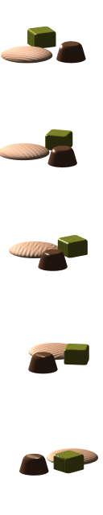

KnobMan3D
=========

Knob Image Design Tool

KnobMan3D is a Knob Image (film-strip) design tool based on WebGL + THREE.js

* Create your own knobs by combination of basic objects
* Animation effects available
* Rendered image can be exported as PNG file

  

Available at :
  [http://g200kg.github.io/knobman3d/](http://g200kg.github.io/knobman3d/)
